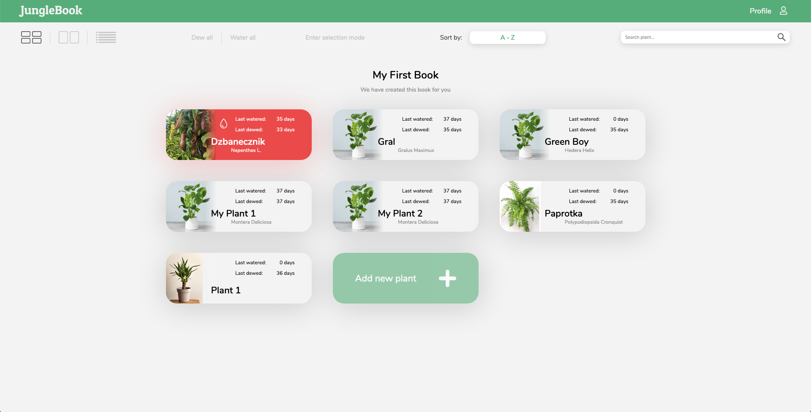
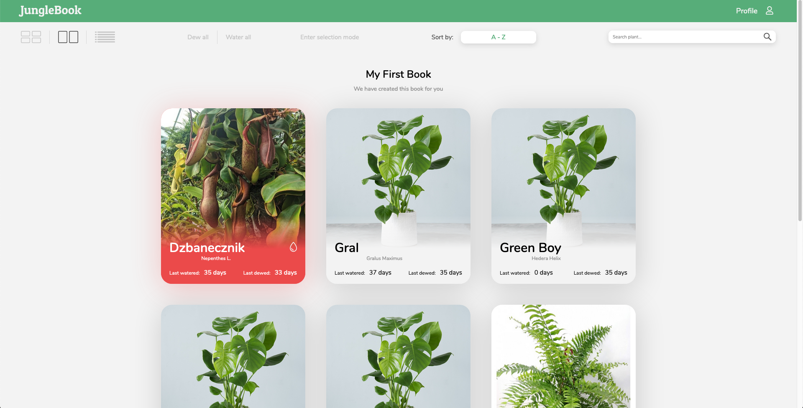
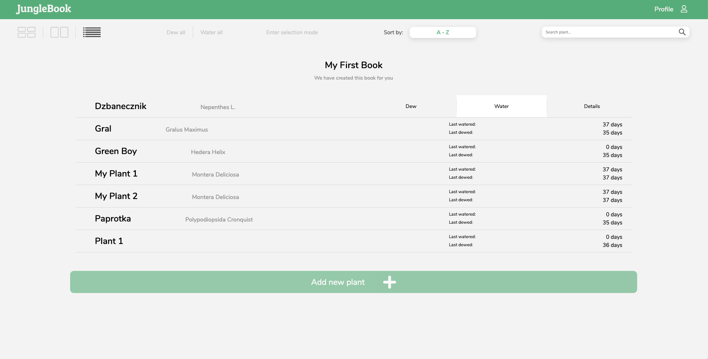
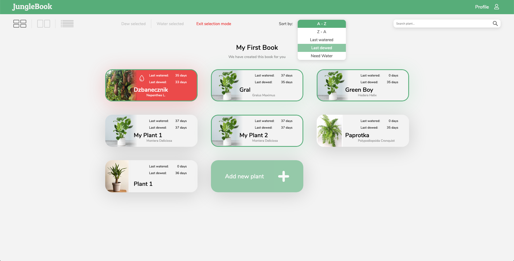
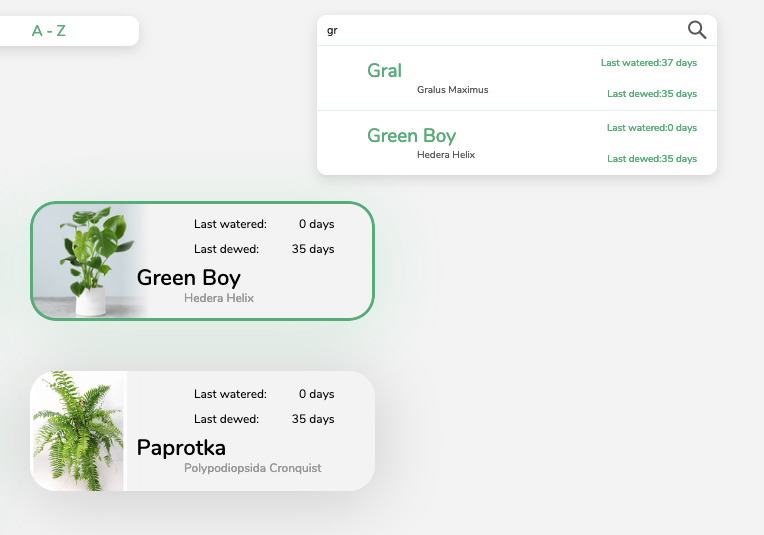
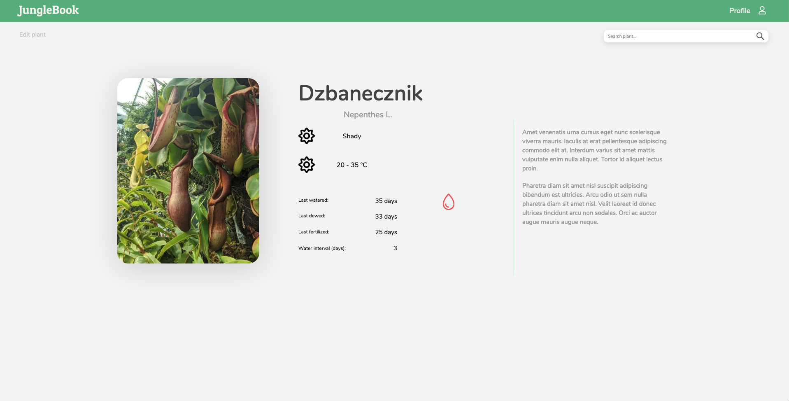
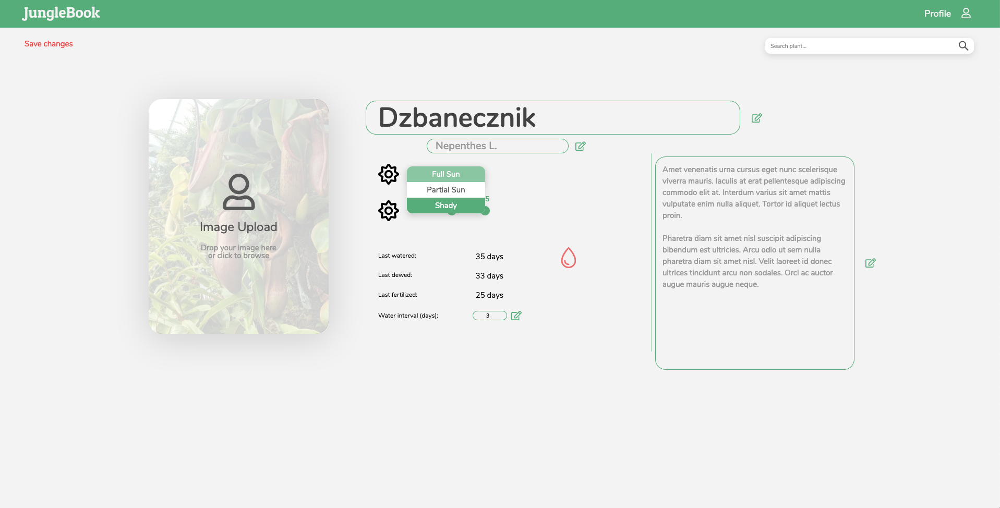
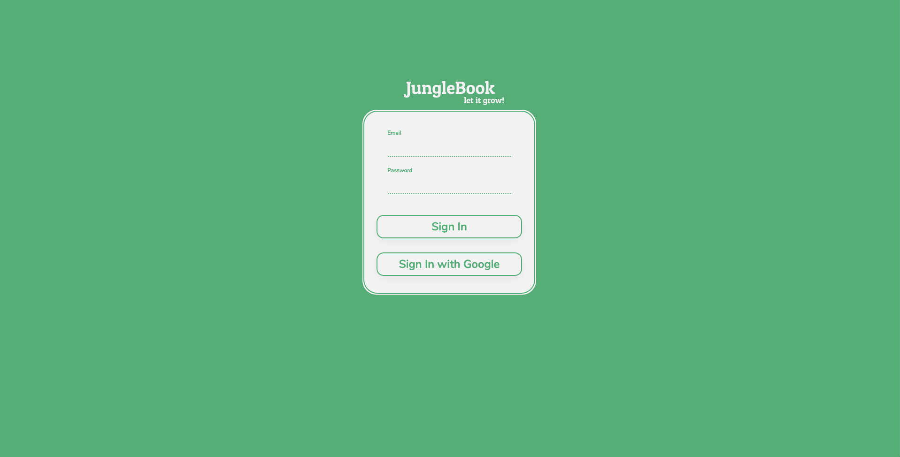

# 

</br>

Web client app for managing your plants.

It consumes JungleBook API: https://github.com/EmilTheSadCat/JungleBook-api
JungleBook API URL: https://junglebook-api.herokuapp.com/api

You can easily check status of your plants. See if they need water.

## Features

-   add and edit new plants
-   water, dew, feritilize single plant
-   water, dew all or selected plants
-   set water interval and alert when plant needs water
-   live search in user's exisitng plants
-   custom made svg loader animation
-   set plant's temperature, lighting, names, description
-   custom made range slider component in plant edit view
-   drag & drop image upload in "Drop like hot" style

## Extensions

Planned featues:

-   share your profile with a friend who might look after your jungle when you're on vacation
-   'Moments' section where you can upload images of your plant and see how it is changing over time

## Screenshots

</br>
<sup>Custom svg loader animation</sup> </br>


</br>
<sup>Dasbhoard - small tiles</sup> </br>


</br>
<sup>Dasbhoard - big tiles</sup> </br>


</br>
<sup>Dasbhoard - list tiles</sup> </br>


</br>
<sup>Dasbhoard - selection mode</sup> </br>


</br>
<sup>Dasbhoard - live search</sup> </br>


</br>
<sup>Dasbhoard - plant details</sup> </br>


</br>
<sup>Dasbhoard - plant details edit</sup> </br>


</br>
<sup>Dasbhoard - sign in</sup> </br>


## Project setup

```

npm install

```

### Compiles and hot-reloads for development

```

npm run serve

```

### Compiles and minifies for production

```

npm run build

```

### Lints and fixes files

```

npm run lint

```

### Customize configuration

See [Configuration Reference](https://cli.vuejs.org/config/).

### Environmental variables

In root folder create `.env` file.

#### Development

```

VUE_APP_API_BASE_URL=http://localhost:5000/api/

```

#### Production

```

VUE_APP_API_BASE_URL=<PRODUCTION_API_URL>

```

## Links

**Note:** _Project is still in development. There is no preview yet._

</br>

-   Repository: https://github.com/EmilTheSadCat/JungleBook-web-client

-   API Repository: https://github.com/EmilTheSadCat/JungleBook-api

## Licensing

The code in this project is licensed under MIT license.
